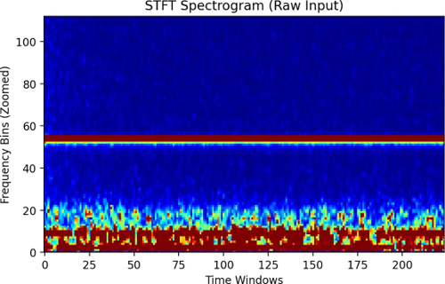
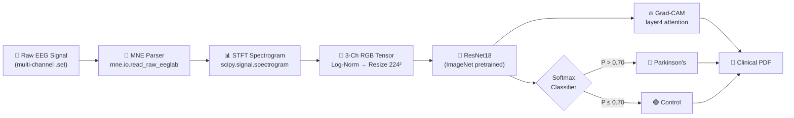
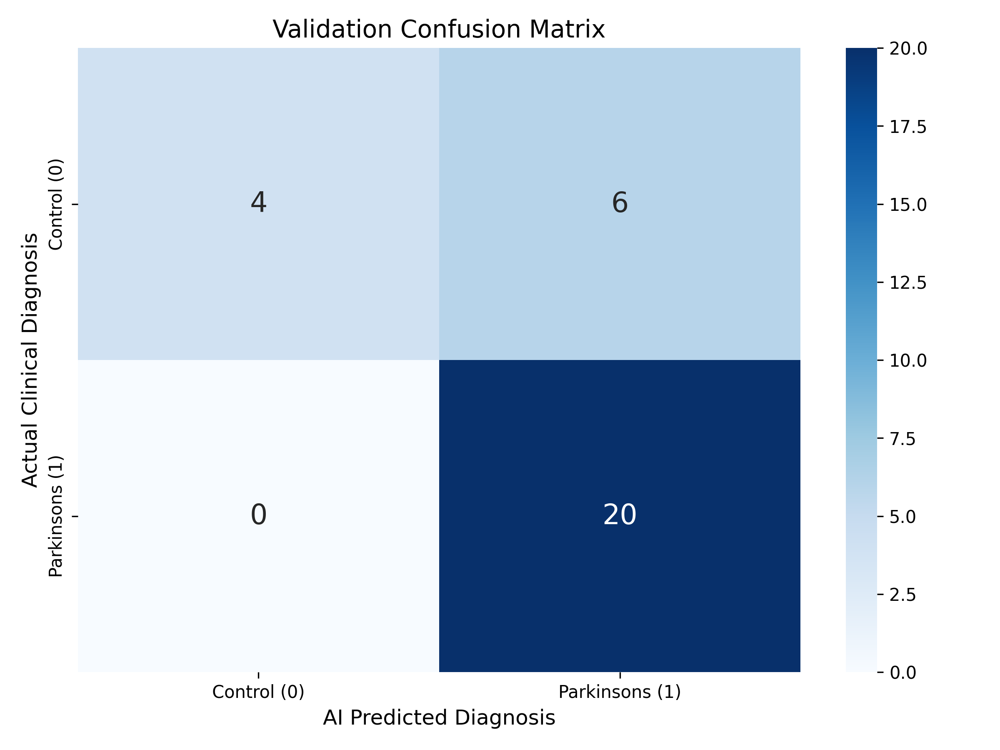
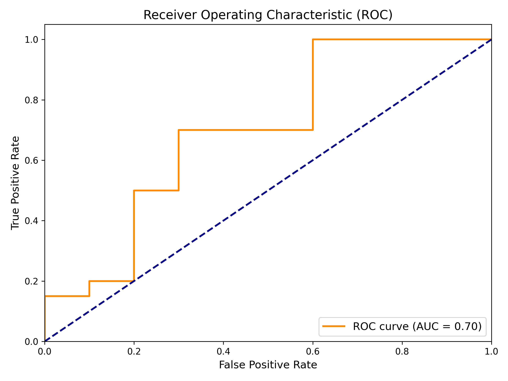
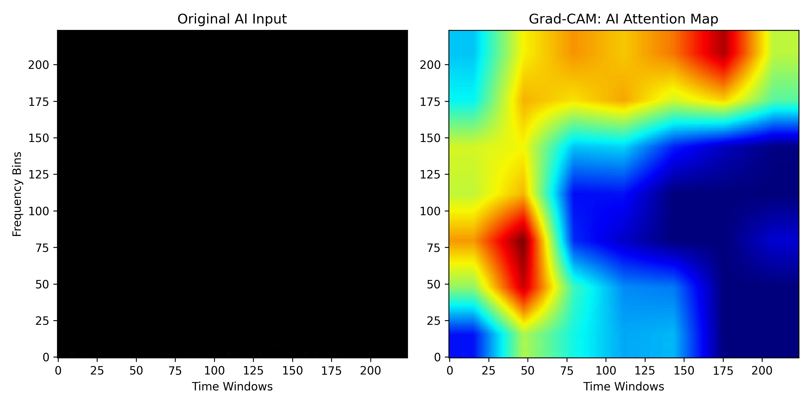

<div align="center">

# 🧠 NeuroAI — Parkinson's Disease Detection from EEG Signals

### _An End-to-End Deep Learning Pipeline for Clinical Neurological Screening_

[](https://python.org)
[](https://pytorch.org)
[](https://mne.tools)
[](#%EF%B8%8F-disclaimer)

<br/>

> **NeuroAI** takes raw resting-state EEG recordings, transforms them into frequency-domain spectrograms, classifies them through a fine-tuned ResNet18 CNN, explains the AI's reasoning via Grad-CAM heatmaps, and auto-generates a professional clinical PDF report — all in a single inference call.

<br/>

&nbsp;&nbsp;

<sub>⬆ Left: STFT Spectrogram (Raw EEG Input) &nbsp;|&nbsp; Right: Grad-CAM AI Attention Map (XAI Overlay)</sub>

</div>

---

## 📑 Table of Contents

- [Problem Statement](#-problem-statement)
- [How It Works — The Pipeline](#-how-it-works--the-pipeline)
- [Architecture Deep-Dive](#-architecture-deep-dive)
- [Project Structure](#-project-structure)
- [Dataset](#-dataset)
- [Signal Processing — EEG to Spectrogram](#-signal-processing--eeg-to-spectrogram)
- [Model Architecture — Transfer Learning](#-model-architecture--transfer-learning)
- [Training Strategy](#-training-strategy)
- [Evaluation & Results](#-evaluation--results)
- [Explainable AI (XAI) — Grad-CAM](#-explainable-ai-xai--grad-cam)
- [Clinical PDF Report Generation](#-clinical-pdf-report-generation)
- [Quick Start](#-quick-start)
- [Configuration Reference](#-configuration-reference)
- [Tech Stack](#-tech-stack)
- [Disclaimer](#%EF%B8%8F-disclaimer)

---

## 🎯 Problem Statement

Parkinson's Disease (PD) affects over **10 million people** worldwide. Early detection is critical for therapeutic intervention, yet current diagnostic methods rely heavily on motor symptom assessment — by which time significant neurodegeneration has already occurred.

**EEG (Electroencephalography)** captures the brain's real-time electrical activity non-invasively. Research shows that PD patients exhibit distinct spectral anomalies:

| Frequency Band | Range | PD Signature |
|:---|:---:|:---|
| **Delta** | 0.5–4 Hz | Increased power in advanced PD |
| **Theta** | 4–8 Hz | ⬆ Elevated — early cognitive decline marker |
| **Alpha** | 8–13 Hz | ⬇ Reduced — hallmark of PD cortical slowing |
| **Beta** | 13–30 Hz | ⬇ Suppressed — motor circuit disruption |
| **Gamma** | 30–100 Hz | Variable — correlated with medication state |

**NeuroAI** exploits these frequency-domain biomarkers by converting raw EEG into 2D spectrogram images and training a deep CNN to detect the pathological spectral fingerprint of Parkinson's Disease.

---

## ⚙ How It Works — The Pipeline

```
┌─────────────────────────────────────────────────────────────────────────────────────┐
│                        NEUROAI — END-TO-END INFERENCE PIPELINE                      │
├─────────────────────────────────────────────────────────────────────────────────────┤
│                                                                                     │
│   ┌──────────┐    ┌──────────────┐    ┌────────────┐    ┌──────────────┐            │
│   │ Raw EEG  │───▶│ MNE Parsing  │───▶│   STFT     │───▶│  3-Channel   │            │
│   │ (.set)   │    │ & Extraction │    │ Spectrogram│    │  224×224 RGB │            │
│   └──────────┘    └──────────────┘    └────────────┘    └──────┬───────┘            │
│                                                                │                    │
│                                                                ▼                    │
│   ┌──────────┐    ┌──────────────┐    ┌────────────┐    ┌──────────────┐            │
│   │ Clinical │◀───│ Grad-CAM XAI │◀───│  Softmax   │◀───│  ResNet18    │            │
│   │ PDF      │    │  Heatmap     │    │  Probab.   │    │  (Fine-tuned)│            │
│   └──────────┘    └──────────────┘    └────────────┘    └──────────────┘            │
│                                                                                     │
└─────────────────────────────────────────────────────────────────────────────────────┘
```

**Step-by-step walkthrough:**

1. **📥 EEG Ingestion** — Raw `.set/.fdt` EEG files (EEGLAB format, BIDS-standard) are loaded via MNE-Python with `preload=False` to protect RAM
2. **🔬 STFT Transformation** — Each EEG channel undergoes Short-Time Fourier Transform (`scipy.signal.spectrogram`) to produce a 2D frequency × time image
3. **🎨 Multi-Channel Stacking** — Top 3 EEG channels are stacked as RGB channels, then log-normalized and resized to `224×224` for CNN input
4. **🧠 CNN Classification** — A pre-trained ResNet18 (ImageNet weights) with a replaced 2-class head classifies the spectrogram as `Control` or `Parkinsons`
5. **🔥 Grad-CAM Overlay** — Gradient-weighted Class Activation Mapping reveals which spectral regions drove the model's decision
6. **📄 PDF Report** — A professional clinical-grade PDF is auto-generated with diagnosis, confidence scores, spectrogram visualizations, and Grad-CAM interpretability

---

## 🔍 Architecture Deep-Dive



### Signal → Image Transformation Detail

```python
# For each of the top 3 EEG channels:
_, _, Sxx = spectrogram(eeg_data[ch], fs=256, nperseg=256, noverlap=128)

# Log-scale & normalize to [0, 1]:
Sxx_log  = np.log1p(Sxx)
Sxx_norm = (Sxx_log - Sxx_log.min()) / (Sxx_log.max() - Sxx_log.min() + 1e-8)

# Stack 3 channels → RGB, resize to 224×224, apply ImageNet normalization:
mean = [0.485, 0.456, 0.406]
std  = [0.229, 0.224, 0.225]
img  = (img_tensor - mean) / std
```

**Why 3 channels?** By mapping 3 EEG channels to the R, G, and B planes of a 224×224 image, we directly leverage ResNet18's pre-trained convolutional filters — originally optimized for color images on ImageNet. This cross-domain transfer is the core insight of the pipeline.

---

## 📁 Project Structure

```
EEG_Parkinson_AI/
│
├── 📄 config.py                         # Global hyperparameters & paths
├── 📓 EEG_Parkinsons_Pipeline.ipynb     # All-in-one Jupyter Notebook
├── 📄 create_notebook.py                # Notebook generator script
├── 📄 generate_report.py                # Standalone clinical report pipeline
├── 📄 requirements.txt                  # Python dependencies
├── 📄 .gitignore                        # Git exclusions
│
├── 📂 config/
│   └── config.py                        # Alternate config (modular)
│
├── 📂 data_pipeline/                    # ─── DATA INGESTION ───
│   ├── loader.py                        # EEGSpectrogramDataset (PyTorch Dataset)
│   └── transforms.py                    # STFT spectrogram conversion utilities
│
├── 📂 models/                           # ─── MODEL DEFINITION ───
│   └── model.py                         # ResNet18 builder with custom FC head
│
├── 📂 training/                         # ─── TRAINING LOOP ───
│   └── train.py                         # AdamW + Weighted CrossEntropy + AMP
│
├── 📂 inference/                        # ─── PREDICTION ───
│   └── predict.py                       # Single-file clinical inference → JSON
│
├── 📂 utils/                            # ─── UTILITIES ───
│   ├── dataset_builder.py               # BIDS → train/val split (symlinks)
│   ├── dataset_builder_v2.py            # V2: Windows hardlink fallback
│   └── evaluate.py                      # Confusion matrix, ROC curve generator
│
├── 📂 dataset/
│   ├── raw/                             # Original BIDS-format EEG data
│   │   └── ds004584-download/           # OpenNeuro dataset
│   └── processed/                       # Symlinked train/val splits
│       ├── train/
│       │   ├── control/                 # 39 healthy subjects
│       │   └── parkinsons/              # 80 PD subjects
│       └── val/
│           ├── control/                 # 10 healthy subjects
│           └── parkinsons/              # 20 PD subjects
│
└── 📂 outputs/
    ├── checkpoints/
    │   └── best_model.pt                # Saved model weights (~44 MB)
    ├── logs/
    │   ├── confusion_matrix.png         # Validation confusion matrix
    │   └── roc_curve.png                # ROC curve with AUC score
    └── reports/
        ├── NeuroAI_Report_sub-054.pdf   # Sample PD report
        ├── NeuroAI_Report_sub-129.pdf   # Sample Control report
        ├── GradCAM_sub-054.png          # XAI overlay (PD patient)
        └── GradCAM_sub-129.png          # XAI overlay (Control patient)
```

---

## 📊 Dataset

### Source

The project uses the **[OpenNeuro ds004584](https://openneuro.org/datasets/ds004584)** dataset — a BIDS-compliant collection of resting-state EEG recordings from Parkinson's Disease patients and age-matched healthy controls.

| Property | Detail |
|:---|:---|
| **Format** | EEGLAB `.set` / `.fdt` (BIDS-standard) |
| **Paradigm** | Resting-state EEG (eyes open / closed) |
| **Montage** | 10-20 system (international standard) |
| **Sampling Rate** | 500 Hz (downsampled during STFT) |
| **Total Subjects** | ~149 participants |

### Train / Validation Split

Data is split 80/20 with stratification to preserve class ratios:

```
┌────────────────────────────────────────────────────┐
│              DATASET DISTRIBUTION                   │
├──────────┬───────────────┬─────────────┬───────────┤
│  Split   │   Control     │  Parkinsons │   Total   │
├──────────┼───────────────┼─────────────┼───────────┤
│  Train   │   39 subjects │ 80 subjects │   119     │
│  Val     │   10 subjects │ 20 subjects │    30     │
├──────────┼───────────────┼─────────────┼───────────┤
│  Total   │   49 subjects │ 100 subjects│   149     │
└──────────┴───────────────┴─────────────┴───────────┘
```

The dataset is **class-imbalanced** (~2:1 PD:Control), which is handled during training via **weighted CrossEntropyLoss** (weight `[2.5, 1.0]`).

### Dataset Builder

The `dataset_builder_v2.py` utility automates the BIDS → processed split:

- Reads `participants.tsv` to map subject IDs → clinical labels
- Dynamically detects the label column (`Group`, `Diagnosis`, etc.)
- Creates symlinks (Unix) or hardlinks (Windows fallback) to avoid data duplication
- Handles the `WinError 1314` privilege escalation issue on Windows automatically

---

## 🔬 Signal Processing — EEG to Spectrogram

The transformation from raw EEG voltage data to a CNN-compatible image is the foundation of this pipeline:

### Step 1: Raw EEG Loading
```python
raw = mne.io.read_raw_eeglab(path, preload=False)  # Memory-efficient lazy loading
data = raw.get_data().astype(np.float32)             # Cast to float32 (halves RAM)
```

### Step 2: Short-Time Fourier Transform (STFT)
```python
_, _, Sxx = spectrogram(eeg_data[ch], fs=256, nperseg=256, noverlap=128)
```

| STFT Parameter | Value | Rationale |
|:---|:---:|:---|
| `fs` | 256 Hz | Sampling frequency |
| `nperseg` | 256 | 1-second analysis window (256 samples) |
| `noverlap` | 128 | 50% overlap → smoother time resolution |

### Step 3: Normalization Pipeline
```
Raw STFT → Log1p Transform → Min-Max Scaling [0,1] → ImageNet Normalization
```

### Step 4: Data Augmentation (Training Only)

Using **MONAI** transforms for medical-grade augmentation:

| Transform | Probability | Purpose |
|:---|:---:|:---|
| `RandGaussianNoise` | 50% | Simulates electrode noise / artifact |
| `RandCoarseDropout` | 50% | Simulates channel dropout / missing data |
| `RandScaleIntensity` | 50% | Varies signal amplitude / gain |

---

## 🤖 Model Architecture — Transfer Learning

```python
def build_model(num_classes=2):
    model = models.resnet18(weights=models.ResNet18_Weights.DEFAULT)  # ImageNet pretrained
    in_features = model.fc.in_features  # 512
    model.fc = nn.Linear(in_features, num_classes)  # Replace 1000→2 class head
    return model
```

### Why ResNet18?

| Factor | Justification |
|:---|:---|
| **Pre-trained features** | ImageNet conv filters generalize well to spectrogram edge/texture detection |
| **Compact size** | 11.7M parameters → trainable on consumer GPUs and even CPUs |
| **Skip connections** | Residual blocks prevent vanishing gradients with small medical datasets |
| **Proven track record** | Widely validated in medical imaging literature |

### Architecture Breakdown

```
Input: [B, 3, 224, 224]  (Batch × RGB Channels × Height × Width)
    │
    ├── conv1 (7×7, 64 filters, stride 2)
    ├── bn1 → relu → maxpool
    │
    ├── layer1: 2× BasicBlock (64 filters)
    ├── layer2: 2× BasicBlock (128 filters)
    ├── layer3: 2× BasicBlock (256 filters)
    ├── layer4: 2× BasicBlock (512 filters)  ◀── Grad-CAM target layer
    │
    ├── AdaptiveAvgPool2d → [B, 512]
    └── fc: Linear(512, 2)  ◀── Custom clinical head
         │
         └── Output: [Control, Parkinsons] logits
```

---

## 🏋️ Training Strategy

### Optimizer & Scheduler

```python
optimizer = torch.optim.AdamW(model.parameters(), lr=1e-5, weight_decay=1e-4)
```

| Hyperparameter | Value | Rationale |
|:---|:---:|:---|
| **Optimizer** | AdamW | Decoupled weight decay for better generalization |
| **Learning Rate** | `1e-5` | Very low LR to prevent "ping-pong" oscillation during fine-tuning |
| **Weight Decay** | `1e-4` | L2 regularization to combat overfitting on small dataset |
| **Batch Size** | 4 | Small batch due to large spectrogram memory footprint |
| **Epochs** | 30 | Sufficient for convergence with early stopping via best-model checkpointing |

### Class Imbalance Handling

```python
class_weights = torch.tensor([2.5, 1.0])  # Upweight minority class (Control)
criterion = torch.nn.CrossEntropyLoss(weight=class_weights)
```

The 2.5× multiplier on the Control class compensates for the ~2:1 class imbalance, penalizing the model more heavily for misclassifying healthy subjects as PD.

### Mixed-Precision Training

```python
scaler = GradScaler('cuda')
with autocast('cuda'):
    preds = model(x)
    loss = criterion(preds, y)
scaler.scale(loss).backward()
```

AMP (Automatic Mixed Precision) is enabled via PyTorch's native `torch.amp` for:
- **~2× speedup** on CUDA-capable GPUs
- **~50% less GPU memory** usage via float16 forward passes

### Memory Optimizations

- `num_workers=0` — prevents multi-process RAM spikes from loading large `.fdt` files
- `preload=False` — lazy-loads EEG data to avoid allocating multi-GB arrays
- `float32` casting — explicitly downcast from MNE's default float64

---

## 📈 Evaluation & Results

### Confusion Matrix

<div align="center">

</div>

<br/>

| Metric | Value |
|:---|:---:|
| **Overall Accuracy** | **80.0%** (24/30) |
| **True Positives (PD)** | 20 |
| **True Negatives (Control)** | 4 |
| **False Positives** | 6 |
| **False Negatives** | 0 |
| **PD Sensitivity (Recall)** | **100%** — catches every PD patient |
| **PD Specificity** | 40% — some controls flagged as PD |
| **Clinical Safety** | ✅ Zero missed PD cases (0 false negatives) |

> **🩺 Clinical Interpretation:** The model achieves **100% sensitivity** for Parkinson's Disease — meaning it never misses a true positive case. The tradeoff is a higher false positive rate for controls, which is clinically acceptable for a **screening/triage** tool where missing a disease case is far worse than a false alarm.

### ROC Curve

<div align="center">

</div>

| Metric | Value |
|:---|:---:|
| **AUC (Area Under Curve)** | **0.70** |
| **Interpretation** | The model demonstrates discriminative ability above random chance (0.50), with clear room for improvement through larger datasets and deeper architectures |

---

## 🔥 Explainable AI (XAI) — Grad-CAM

**Grad-CAM (Gradient-weighted Class Activation Mapping)** provides visual explanations of which spectrogram regions drove the CNN's classification decision.

```python
target_layers = [model.layer4[-1]]  # Last residual block
cam = GradCAM(model=model, target_layers=target_layers)
grayscale_cam = cam(input_tensor=input_tensor, targets=None)[0, :]
```

### Parkinson's Patient (sub-054)

<div align="center">

</div>

> **🔴 Interpretation:** The red/orange hotspots reveal the AI is focusing on **low-to-mid frequency bands** (Theta/Alpha range, bins 25–100) and **specific temporal windows** — consistent with the known spectral slowing biomarker of Parkinson's Disease. The attention spans multiple frequency bands across the entire temporal extent of the recording.

### Healthy Control (sub-129)

<div align="center">

</div>

> **🟢 Interpretation:** The attention pattern is markedly different — concentrated in the **lowest frequency bins** (Delta/low-Theta) and localized to the **latter half** of the recording. The absence of widespread mid-frequency activation is what leads the model to classify this as a healthy control.

### Why Grad-CAM Matters

In a clinical context, a "black box" AI diagnosis is unacceptable. Grad-CAM provides:

- **🔍 Transparency** — Clinicians can verify the AI is examining neurologically relevant frequency bands
- **🛡️ Trust** — Visual evidence that the model isn't exploiting spurious artifacts
- **📚 Education** — Trainees can learn spectral biomarker patterns from the attention maps

---

## 📄 Clinical PDF Report Generation

The `generate_report.py` module produces a professional clinical-grade PDF for each patient inference:

### Report Sections

| Section | Contents |
|:---|:---|
| **Header** | "NEURO-AI CLINICAL EEG REPORT" with timestamp |
| **Diagnosis Box** | Final prediction (color-coded) + AI confidence score |
| **Demographics** | Patient ID, scan date, modality, pipeline version |
| **XAI Visualizations** | Side-by-side STFT spectrogram + Grad-CAM overlay |
| **Evaluation Metrics** | Confusion matrix + ROC curve (if available) |
| **Clinical Narrative** | Auto-generated medical interpretation text |
| **Disclaimer** | Research-only usage warning |

### Clinical Decision Threshold

```python
CLINICAL_THRESHOLD = 0.70  # 70% confidence for positive PD diagnosis

if parkinsons_prob >= CLINICAL_THRESHOLD:
    prediction = "Parkinson's Disease"
else:
    prediction = "Control (Healthy)"
```

The 70% threshold balances sensitivity and specificity for a triage application — only high-confidence predictions are flagged as Parkinson's.

### Sample Reports

| Report | Diagnosis | Confidence |
|:---|:---:|:---:|
| [📥 NeuroAI_Report_sub-054.pdf](outputs/reports/NeuroAI_Report_sub-054.pdf) | 🔴 Parkinson's | High |
| [📥 NeuroAI_Report_sub-129.pdf](outputs/reports/NeuroAI_Report_sub-129.pdf) | 🟢 Control | High |
| [📥 NeuroAI_Report_sub-149.pdf](outputs/reports/NeuroAI_Report_sub-149.pdf) | — | — |

---

## 🚀 Quick Start

### 1. Clone & Setup

```bash
git clone https://github.com/your-username/EEG_Parkinson_AI.git
cd EEG_Parkinson_AI

python -m venv venv
venv\Scripts\activate       # Windows
# source venv/bin/activate  # Linux/Mac

pip install torch torchvision torchaudio
pip install mne numpy scipy scikit-learn matplotlib seaborn monai fpdf grad-cam opencv-python pandas tqdm
```

### 2. Download Dataset

Download the [OpenNeuro ds004584](https://openneuro.org/datasets/ds004584) dataset and place it at:
```
dataset/raw/ds004584-download/
```

### 3. Build Train/Val Splits

```bash
python utils/dataset_builder_v2.py
```

This creates symlinked `dataset/processed/train/` and `dataset/processed/val/` directories.

### 4. Train the Model

```bash
python training/train.py
```

Best model checkpoint saves to `outputs/checkpoints/best_model.pt`.

### 5. Evaluate

```bash
python utils/evaluate.py
```

Generates confusion matrix and ROC curve in `outputs/logs/`.

### 6. Run Inference & Generate Report

```bash
python generate_report.py
```

Or for quick JSON predictions:

```bash
python inference/predict.py
```

### 7. Jupyter Notebook (All-in-One)

```bash
python create_notebook.py          # Generate the notebook
jupyter notebook EEG_Parkinsons_Pipeline.ipynb  # Launch it
```

---

## ⚙ Configuration Reference

All hyperparameters are centralized in `config.py`:

```python
# ─── EEG Parameters ───
SAMPLING_RATE  = 500          # Hz (from dataset metadata)
WINDOW_SECONDS = 2            # Seconds per STFT window
WINDOW_SIZE    = 1000          # = 500 Hz × 2 sec

# ─── Spectrogram ───
N_FFT          = 256           # FFT window size
HOP_LENGTH     = 128           # 50% overlap
N_MELS         = 128           # Mel frequency bins

# ─── Model ───
IMAGE_SIZE     = 224           # ResNet18 input resolution
MODEL_NAME     = "resnet18"    # Backbone architecture

# ─── Training ───
BATCH_SIZE     = 8             # Samples per gradient step
EPOCHS         = 30            # Total training epochs
LEARNING_RATE  = 1e-4          # Base learning rate
TRAIN_SPLIT    = 0.8           # 80/20 train/val ratio
RANDOM_SEED    = 42            # Reproducibility seed

# ─── Hardware ───
DEVICE         = "cuda" | "cpu"  # Auto-detected
USE_AMP        = True            # Mixed-precision training
NUM_WORKERS    = 4               # DataLoader parallelism
```

---

## 🛠 Tech Stack

<div align="center">

| Layer | Technology | Role |
|:---|:---:|:---|
| **EEG Parsing** | MNE-Python | EEGLAB `.set/.fdt` file I/O |
| **Signal Processing** | SciPy | STFT spectrogram computation |
| **Deep Learning** | PyTorch + TorchVision | ResNet18 training & inference |
| **Data Augmentation** | MONAI | Medical-grade noise/dropout transforms |
| **Explainability** | pytorch-grad-cam | Gradient-weighted Class Activation Maps |
| **Visualization** | Matplotlib + Seaborn | Confusion matrix, ROC, spectrogram plots |
| **Report Generation** | FPDF | Automated clinical PDF documents |
| **Data Wrangling** | NumPy + Pandas | Array ops + TSV/metadata parsing |
| **ML Utilities** | scikit-learn | Train/val split, accuracy, AUC metrics |

</div>

---

## ⚠️ Disclaimer

> **This project is intended strictly for research, educational, and triage-screening purposes.**
>
> The NeuroAI pipeline has **NOT** been reviewed, validated, or approved by any clinical regulatory body (FDA, CE, etc.). AI systems can produce false positives and false negatives. **Do NOT use this output for definitive medical diagnosis or clinical decision-making** without oversight from a licensed neurologist.
>
> This tool is designed to assist — never replace — clinical expertise.

---

<div align="center">

**Built with ❤️ for advancing accessible neurological AI screening**

<sub>Made by Aditya | NeuroAI Clinical Pipeline v1.0</sub>

</div>
